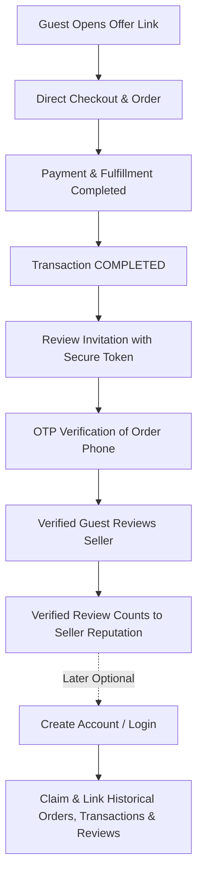
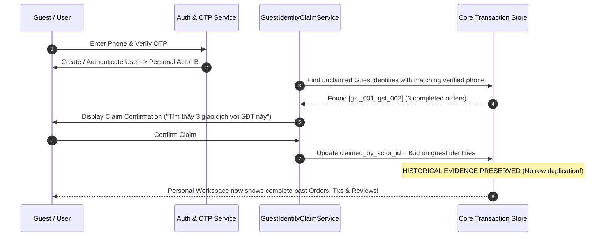

# GUEST TRANSACTION PARTICIPANT, VERIFIED GUEST REVIEW & ACCOUNT CLAIM ARCHITECTURE ADDENDUM
## Module 00 - Architecture Specification: Guest Participant Identity, Frictionless Verification, Verified Reviews & Non-Destructive History Claim

> **Core Product Principle:**  
> **TRANSACTION FIRST. REGISTRATION SECOND.**  
> **A USER ACCOUNT IS NOT REQUIRED TO CREATE A VERIFIED TRANSACTION.**  
> **IDENTITY GROWS WITH THE TRANSACTION:** `GUEST` $\rightarrow$ `VERIFIED GUEST PARTICIPANT` $\rightarrow$ `PERSONAL ACTOR` (Continuous Historical Evidence).

---

## 1. Registered Actor vs. Guest Participant

The platform recognizes two fundamental types of transaction participants:

1. **Registered Actor (`ACTOR`):**
   - Has an authoritative `UserIdentity` and an associated Actor (`PERSONAL` or `ORGANIZATION`).
   - Authenticated via session/JWT/Passkey.
2. **Guest Transaction Participant (`GUEST`):**
   - Has **NO** user account, password, or registration prior to checkout.
   - Identified in the system by an immutable internal Guest ID (e.g. `gst_9x8a2...`).
   - Transaction-scoped identity that can be verified via transaction-linked contact (Phone OTP / Email).



---

## 2. Transaction Party Model (Bilateral Parties)

Every transaction has exactly two parties: **Buyer** and **Seller**.
Instead of forcing every party to be a registered `actor_id`, the system supports:

```typescript
export type ParticipantType = 'ACTOR' | 'GUEST';

export interface TransactionParty {
  id: string;                      // tparty_xxx
  transaction_id: string;
  role: 'BUYER' | 'SELLER';
  participant_type: ParticipantType;
  actor_id?: string | null;         // Null if Guest
  guest_identity_id?: string | null; // Null if Registered Actor
  claimed_by_actor_id?: string | null; // Populated when claimed
  display_name?: string;
  created_at: string;
}
```

---

## 3. Guest Identity Entity (`guest_identities`)

Guest identities are immutable, non-enumerable internal records:

```typescript
export interface GuestIdentity {
  id: string;                        // gst_xxx (NEVER raw phone number)
  status: 'ACTIVE' | 'CLAIMED' | 'ARCHIVED';
  display_name?: string;              // Extracted & masked from order contact (e.g. "Trần N.")
  verified_phone?: string;            // Normalized E.164 phone
  phone_verified_at?: string;         // ISO timestamp when OTP verified
  verified_email?: string;
  email_verified_at?: string;
  claimed_by_actor_id?: string | null; // ID of Personal Actor who claimed this guest history
  claimed_at?: string | null;
  created_at: string;
  updated_at: string;
}
```

> [!IMPORTANT]
> **Guest ID $\neq$ Phone Number:** Phone number is a verified identifier associated with the guest identity, NOT the primary key. Phone numbers can change or be recycled over time.

---

## 4. Guest Contact Verification

1. **Supply vs. Verification:**
   - **Contact Supplied:** Phone/Name entered at checkout.
   - **Contact Verified:** Phone ownership proven via 6-digit OTP during checkout, payment confirmation, review submission, or account claim.
2. **Verified Guest Status:** Once OTP is verified, the participant is classified as a **Verified Guest Participant**. No user account is created.

---

## 5. Guest Checkout Flow (Frictionless)

1. Buyer opens Offer Link `/[store_slug]/o/[offer_slug]`.
2. Selects variant / quantity $\rightarrow$ Clicks "Mua ngay" / "Đặt hàng".
3. Enters recipient name, phone, delivery address.
4. Order created immediately with `buyer_participant_type: 'GUEST'` and `guest_identity_id: 'gst_...'`.
5. Payment completed (VietQR / COD) $\rightarrow$ Transaction state moves to `COMPLETED`.
6. **Zero registration wall, zero forced account onboarding.**

---

## 6. Review Invitation & Secure Token Flow

Upon Transaction completion:
1. System generates a `review_invitation` record with a cryptographically secure token hash.
2. Link generated: `/review/{secureToken}` (or embedded in order tracking).
3. **High-Trust Verification:** Token validation is coupled with transaction phone confirmation (OTP verification to masked phone `***1234`).
4. **Tamper Proof:** The backend derives `transaction_id`, `seller_id`, and `reviewee_name` directly from the authoritative invitation. The client CANNOT alter the target transaction or reviewee.

---

## 7. Guest $\rightarrow$ Seller Review Model

When a Guest Buyer reviews a Seller:
- `reviewer_party_type`: `'GUEST'`
- `reviewer_guest_identity_id`: `'gst_xxx'`
- `reviewer_actor_id`: `null`
- `reviewee_actor_id`: Seller Organization / Personal Actor
- `reviewer_role`: `'BUYER'`
- `overall_rating`: 1–5 stars (Required)
- Criteria: Accuracy, Timeliness, Communication, Quality.
- `performed_by_user_id`: `null` (Audit tracks `guest_identity_id` & `verification_method: 'PHONE_OTP'`).

---

## 8. Seller $\rightarrow$ Guest Buyer Review & Unclaimed Reputation

When Seller reviews Guest Buyer:
- `reviewer_actor_id`: Seller Actor
- `reviewee_party_type`: `'GUEST'`
- `reviewee_guest_identity_id`: `'gst_xxx'`
- `reviewer_role`: `'SELLER'`
- Criteria: Payment Timeliness, Clarity, Cooperation.
- **Unclaimed Reputation Storage:** Stored as private reputation data attached to `guest_identity_id`.
- **Privacy Rule:** No public guest profile (e.g. `/users/gst_001`) is ever created.

---

## 9. Double-Blind & Aggregation Rules

1. **Double-Blind Integrity:** Guest reviews follow the exact same Double-Blind rules: review is `HIDDEN_PENDING_REVEAL` until both parties submit or 14-day deadline passes.
2. **Seller Reputation Aggregation:** Verified Guest Reviews **SHOULD and MUST** count towards the Seller's public average rating, review count, and reputation metrics. Lack of account registration does not diminish the validity of a real, completed transaction review.
3. **Public Badge & Display:**
   - Reviewer Display: **Khách hàng đã xác minh** (or masked name `Nguyễn A.`).
   - Badge: **✓ Đánh giá từ giao dịch đã xác minh**
   - Tooltip: *"Đánh giá này được gửi bởi người mua của một giao dịch đã hoàn thành trên nền tảng."*

---

## 10. Account Claim Architecture (Non-Destructive Linking)

When a Guest subsequently creates an account or logs in:



### Claim Principles:
1. **Link, Do Not Copy:** Claim links existing rows via `claimed_by_actor_id`; it NEVER duplicates orders, transactions, or reviews.
2. **Historical Immutability:** The historical transaction snapshot remains immutable (*"At transaction time, Buyer was Guest"*).
3. **Reputation Recomputation:** After claim, any Seller reviews of `gst_001` automatically contribute to Personal Actor B's eligible reputation metrics.
4. **Cross-Actor Isolation:** Default claim target is the user's **Personal Actor**, NEVER an Organization without explicit administrative approval.

---

## 11. Security, Anti-Abuse & Privacy Controls

1. **One Review per Party per Transaction:** Database unique constraint on `(transaction_id, reviewer_guest_identity_id, reviewee_actor_id)`.
2. **Token Replay & Expiry Prevention:** Invitations transition to `USED` after submission; cannot be reused or replayed.
3. **Public API Safe DTO (`PublicReviewDTO`):** Never leaks raw `guest_identity_id`, raw phone, email, or shipping address in public review feeds.
4. **Audit Trail:** Logs `GUEST_IDENTITY_CREATED`, `GUEST_CONTACT_VERIFIED`, `GUEST_REVIEW_SUBMITTED`, `GUEST_IDENTITY_CLAIMED`.

---

## 12. Acceptance Test Matrix (Bộ Tiêu Chí Chấp Nhận)

| Test ID | Scenario | Expected Outcome |
|---|---|---|
| **AT-GP01** | Guest orders via Offer link without account | Order and Transaction created with `buyer_participant_type: GUEST`, no user created. |
| **AT-GP02** | Completed transaction triggers review invitation | Secure link `/review/{token}` generated, valid for 14 days. |
| **AT-GP03** | Guest submits review via Phone OTP | Review submitted as `GUEST` participant, status `HIDDEN_PENDING_REVEAL`, 0 account created. |
| **AT-GP04** | Double-Blind reveal with Guest | When Seller also reviews, both reviews reveal to `PUBLISHED` simultaneously. |
| **AT-GP05** | Guest review counted in Seller rating | Seller's average rating and verified review count update accurately. |
| **AT-GP06** | Public review feed privacy | Guest reviewer shows as "Khách hàng đã xác minh" or masked name, no phone/email leak. |
| **AT-GP07** | Seller reviews Guest buyer | Review stored as Unclaimed Guest Reputation under `guest_identity_id`. |
| **AT-GP08** | Guest later registers with verified phone | System detects unclaimed history, prompts confirmation, links to Personal Actor without duplicating records. |
| **AT-GP09** | Claimed history in Personal Workspace | User views previous guest orders, transactions, and reviews given/received seamlessly. |
| **AT-GP10** | Token tampering / replay attack | Reused or manipulated token rejected with 403 Forbidden. |
