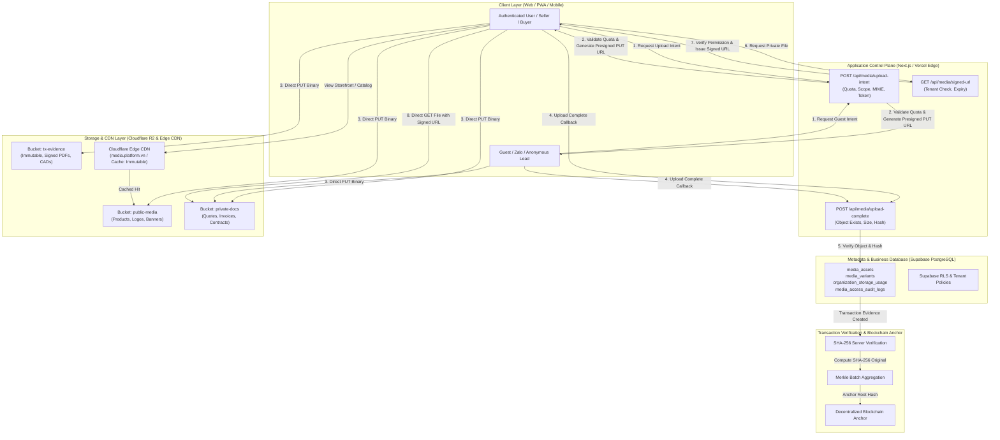
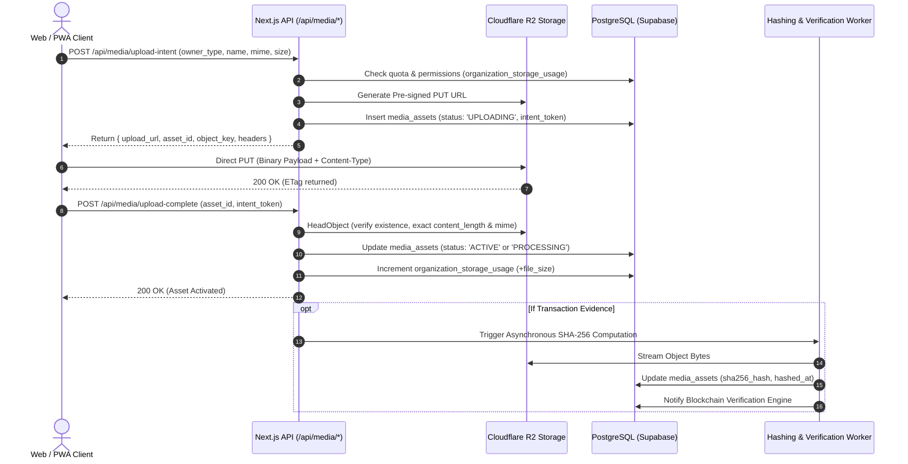

# MEDIA & FILE STORAGE ARCHITECTURE ADDENDUM
## Enterprise-Grade Cloud Object Storage, Document Integrity & Verification Engine Integration

> **Target Architecture:** Scalable Cloud Object Storage (Cloudflare R2 / S3-compatible) + Edge CDN + Supabase PostgreSQL Metadata & RLS + Next.js App Router  
> **Core Guarantee:** Zero binary storage in PostgreSQL database; 100% Direct-to-Storage Client Uploads via Pre-signed URLs; Cryptographic SHA-256 Immutability for Transaction Evidence & Blockchain Anchoring.

---

## 1. STORAGE TOPOLOGY



---

## 2. STORAGE ABSTRACTION

To ensure zero vendor lock-in with Cloudflare R2, all storage operations interact exclusively through the abstract `StorageProvider` interface.

```typescript
// lib/storage/types.ts

export interface PresignedUploadResult {
  upload_url: string;
  asset_id: string;
  object_key: string;
  bucket: string;
  expires_in_seconds: number;
  headers?: Record<string, string>;
}

export interface PresignedDownloadResult {
  download_url: string;
  expires_in_seconds: number;
}

export interface ObjectMetadata {
  content_type: string;
  content_length: number;
  etag?: string;
  last_modified?: Date;
  sha256?: string;
  custom_metadata?: Record<string, string>;
}

export interface StorageProvider {
  createUploadUrl(params: {
    bucket: string;
    object_key: string;
    content_type: string;
    content_length: number;
    expires_in_seconds?: number;
    acl?: 'public-read' | 'private';
  }): Promise<PresignedUploadResult>;

  createDownloadUrl(params: {
    bucket: string;
    object_key: string;
    expires_in_seconds?: number;
    response_content_disposition?: string;
  }): Promise<PresignedDownloadResult>;

  deleteObject(params: { bucket: string; object_key: string }): Promise<void>;
  copyObject(params: { source_bucket: string; source_key: string; target_bucket: string; target_key: string }): Promise<void>;
  getMetadata(params: { bucket: string; object_key: string }): Promise<ObjectMetadata>;
  objectExists(params: { bucket: string; object_key: string }): Promise<boolean>;
  getObjectHash(params: { bucket: string; object_key: string }): Promise<string>;
}
```

### Supported Adapters
1. `R2StorageAdapter` (Cloudflare R2 via AWS S3 SDK v3)
2. `S3StorageAdapter` (AWS S3)
3. `GCSStorageAdapter` (Google Cloud Storage)
4. `SupabaseStorageAdapter` (Supabase Storage)
5. `MockStorageAdapter` (Local in-memory / Local filesystem for offline CI/CD)

---

## 3. MEDIA DATA MODEL (PostgreSQL Schema)

```sql
-- Migration: 20260830_media_storage_architecture.sql

-- 1. Enum Types
CREATE TYPE media_owner_type AS ENUM (
  'STORE', 'OFFER', 'OFFER_ITEM', 'REQUEST', 'QUOTATION', 
  'ORDER', 'TRANSACTION', 'USER_PROFILE', 'ORGANIZATION', 
  'DELIVERY', 'INVOICE', 'CONTRACT', 'OTHER'
);

CREATE TYPE media_visibility AS ENUM (
  'PUBLIC', 'PRIVATE', 'AUTHORIZED_VIEWER', 'TRANSACTION_EVIDENCE'
);

CREATE TYPE media_asset_status AS ENUM (
  'UPLOADING', 'PROCESSING', 'ACTIVE', 'QUARANTINED', 
  'SOFT_DELETED', 'ARCHIVED', 'PURGED', 'FAILED', 'TEMP'
);

CREATE TYPE storage_provider_type AS ENUM (
  'CLOUDFLARE_R2', 'AWS_S3', 'GOOGLE_CLOUD_STORAGE', 'SUPABASE_STORAGE', 'LOCAL_MOCK'
);

-- 2. Core Media Assets Table
CREATE TABLE media_assets (
  id UUID PRIMARY KEY DEFAULT gen_random_uuid(),
  organization_id UUID REFERENCES organizations(id) ON DELETE CASCADE,
  owner_type media_owner_type NOT NULL,
  owner_id UUID, -- Polymorphic reference (nullable for TEMP uploads)
  storage_provider storage_provider_type NOT NULL DEFAULT 'CLOUDFLARE_R2',
  bucket VARCHAR(128) NOT NULL,
  object_key TEXT NOT NULL UNIQUE,
  original_file_name TEXT NOT NULL,
  mime_type VARCHAR(128) NOT NULL,
  file_size BIGINT NOT NULL,
  file_extension VARCHAR(32) NOT NULL,
  width INT,
  height INT,
  duration_seconds INT,
  visibility media_visibility NOT NULL DEFAULT 'PUBLIC',
  status media_asset_status NOT NULL DEFAULT 'UPLOADING',
  sha256_hash VARCHAR(64),
  hash_algorithm VARCHAR(16) DEFAULT 'SHA-256',
  hashed_at TIMESTAMPTZ,
  uploaded_by_user_id UUID REFERENCES auth.users(id),
  uploaded_by_guest_identity_id UUID,
  upload_intent_token VARCHAR(256),
  retention_until TIMESTAMPTZ,
  deleted_at TIMESTAMPTZ,
  created_at TIMESTAMPTZ NOT NULL DEFAULT NOW(),
  updated_at TIMESTAMPTZ NOT NULL DEFAULT NOW()
);

-- 3. Media Derivatives & Variants Table (Thumbnails, WebP/AVIF)
CREATE TABLE media_variants (
  id UUID PRIMARY KEY DEFAULT gen_random_uuid(),
  media_asset_id UUID NOT NULL REFERENCES media_assets(id) ON DELETE CASCADE,
  variant_type VARCHAR(32) NOT NULL, -- 'thumbnail_320', 'medium_800', 'large_1600', 'square_400'
  width INT NOT NULL,
  height INT NOT NULL,
  mime_type VARCHAR(64) NOT NULL,
  bucket VARCHAR(128) NOT NULL,
  object_key TEXT NOT NULL UNIQUE,
  file_size BIGINT NOT NULL,
  created_at TIMESTAMPTZ NOT NULL DEFAULT NOW()
);

-- 4. Organization Storage Usage & Quota Tracking
CREATE TABLE organization_storage_usage (
  organization_id UUID PRIMARY KEY REFERENCES organizations(id) ON DELETE CASCADE,
  plan_tier VARCHAR(32) NOT NULL DEFAULT 'FREE', -- 'FREE' (1GB), 'PRO' (10GB), 'BUSINESS' (50GB), 'ENTERPRISE' (Custom)
  quota_bytes BIGINT NOT NULL DEFAULT 1073741824, -- 1 GB default for FREE
  total_bytes BIGINT NOT NULL DEFAULT 0,
  public_media_bytes BIGINT NOT NULL DEFAULT 0,
  private_document_bytes BIGINT NOT NULL DEFAULT 0,
  transaction_evidence_bytes BIGINT NOT NULL DEFAULT 0,
  asset_count INT NOT NULL DEFAULT 0,
  updated_at TIMESTAMPTZ NOT NULL DEFAULT NOW()
);

-- 5. Media Access Audit Logs (Sensitive / Transaction Evidence Access)
CREATE TABLE media_access_audit_logs (
  id UUID PRIMARY KEY DEFAULT gen_random_uuid(),
  media_asset_id UUID NOT NULL REFERENCES media_assets(id) ON DELETE CASCADE,
  user_id UUID REFERENCES auth.users(id),
  guest_identity_id UUID,
  action VARCHAR(64) NOT NULL, -- 'FILE_VIEWED', 'SIGNED_URL_CREATED', 'FILE_DOWNLOADED', 'EVIDENCE_VERIFIED'
  ip_address INET,
  user_agent TEXT,
  created_at TIMESTAMPTZ NOT NULL DEFAULT NOW()
);

-- 6. Indices for High-Performance Queries
CREATE INDEX idx_media_assets_org ON media_assets(organization_id);
CREATE INDEX idx_media_assets_owner ON media_assets(owner_type, owner_id);
CREATE INDEX idx_media_assets_status ON media_assets(status);
CREATE INDEX idx_media_assets_hash ON media_assets(sha256_hash);
CREATE INDEX idx_media_assets_temp_cleanup ON media_assets(status, created_at) WHERE status = 'TEMP';
```

---

## 4. BUCKET STRATEGY

| Bucket Category | Identifier | Visibility | CDN Caching Policy | Access Control | Primary Use Case |
| :--- | :--- | :--- | :--- | :--- | :--- |
| **PUBLIC_MEDIA** | `r2-commerce-public` | Public (via CDN) | `public, max-age=31536000, immutable` | Direct Edge CDN Read | Product/service photos, store logos, banners, avatar images. |
| **PRIVATE_DOCUMENTS** | `r2-commerce-private` | Private | `no-store, private` | Pre-signed URLs (5 - 60 mins expiry) | Quotations, invoices, buyer/seller business documents. |
| **TRANSACTION_EVIDENCE** | `r2-commerce-evidence` | Private & Immutable | `no-store, private` | Pre-signed URLs + Permission Audit | Signed contracts, delivery proofs, CAD blueprints, verified receipts. |
| **TEMP_UPLOADS** | `r2-commerce-temp` | Private | None | Short-lived Intent Token | In-flight direct uploads before attachment to business objects. |

---

## 5. OBJECT KEY STRATEGY

Object paths are strictly deterministic, tenant-isolated, and audit-ready:

* **Tenant Asset:**  
  `organizations/{organization_id}/{owner_type}/{owner_id}/{asset_id}/{safe_filename}.{ext}`
* **Derivative Variant:**  
  `organizations/{organization_id}/{owner_type}/{owner_id}/{asset_id}/variants/{variant_name}.webp`
* **Guest Upload:**  
  `guests/{guest_identity_id}/{owner_type}/{session_id}/{asset_id}/{safe_filename}.{ext}`
* **Transaction Evidence:**  
  `evidence/{organization_id}/v{version_number}/{asset_id}/{sha256_prefix}_{safe_filename}.{ext}`

---

## 6. UPLOAD ARCHITECTURE (Direct-to-Storage)



---

## 7. PUBLIC & PRIVATE ACCESS MODEL

* **Public Delivery Layer (`MediaUrlService.getPublicUrl`):**
  * Format: `https://cdn.platform.vn/{object_key}`
  * Headers: `Cache-Control: public, max-age=31536000, immutable`
  * Direct Edge caching via Cloudflare CDN.
* **Private Delivery Layer (`MediaUrlService.getPrivateSignedUrl`):**
  * Validates user authentication + tenant ownership or quotation receiver permission.
  * Issues pre-signed URL with configurable expiry (e.g. 15 minutes).
  * Logs access into `media_access_audit_logs`.
  * URL is never stored permanently in database.

---

## 8. IMAGE OPTIMIZATION & VARIANT PIPELINE

* **Standard Variants:**
  * `thumbnail_320`: 320px width (Catalog cards, table thumbnails)
  * `medium_800`: 800px width (Product details, gallery carousel)
  * `large_1600`: 1600px width (High-res zoom, desktop banner)
  * `social_og`: 1200x630px (OpenGraph Zalo/Facebook preview)
* **Format:** WebP default with AVIF where supported.
* **Integrity Guard:** For `TRANSACTION_EVIDENCE` and technical PDFs/CAD files, original raw bytes are preserved uncompressed and unmodified.

---

## 9. TRANSACTION EVIDENCE & SHA-256 IMMUTABILITY

1. Files categorized as `TRANSACTION_EVIDENCE` are **append-only and version-immutable**.
2. Never overwrite an existing object key. If a quotation or drawing is revised, a new version record is created (`quotation-v2.pdf`).
3. SHA-256 hash is computed directly on raw original bytes on the server/worker.
4. The resulting `sha256_hash` is fed into the **Blockchain Merkle Tree Verification Engine** to prove document authenticity and timestamp to buyers, sellers, and third-party auditors.

---

## 10. STORAGE QUOTA, RETENTION & CLEANUP

* **Plan Tier Quotas:**
  * `FREE`: 1 GB
  * `PRO`: 10 GB
  * `BUSINESS`: 50 GB
  * `ENTERPRISE`: Custom SLA
* **Lifecycle Rules:**
  * `TEMP` uploads not attached within 24h are automatically purged by cron worker.
  * `SOFT_DELETED` assets remain in trash for 30 days before purge.
  * Verified Transaction Evidence files are **permanently exempt from purge** to guarantee legal and audit compliance.

---

## 11. GUEST UPLOAD & ACCOUNT CLAIMING

* Guests submitting requests or responding to quotations receive short-lived, session-scoped upload intent tokens.
* When a guest creates an account or claims ownership, the existing `media_assets` are linked to the newly registered `organization_id` via metadata update with zero re-upload or physical object migration required.

---

## 12. IMPLEMENTATION MODULES ROADMAP

| Module | Title | Description |
| :--- | :--- | :--- |
| **MS00** | Architecture Addendum | Complete storage architecture documentation (This document). |
| **MS01** | Media Asset Schema | PostgreSQL migration & Drizzle/Prisma/Supabase schema definitions. |
| **MS02** | Storage Provider Interface | Abstract `StorageProvider` definition and factory. |
| **MS03** | Cloudflare R2 Adapter | Concrete S3-compatible adapter for Cloudflare R2. |
| **MS04** | Upload Intent API | Secure endpoint to validate quota and generate presigned PUT URLs. |
| **MS05** | Direct Upload Client | Frontend dropzone, camera upload, progress bar, and retry mechanism. |
| **MS06** | Upload Completion API | Verification endpoint to activate uploaded assets. |
| **MS07** | Public Media CDN Delivery | CDN URL generation and cache-busting helpers. |
| **MS08** | Private Media & Signed URLs | Authentication and authorized presigned download generation. |
| **MS09** | Image Optimization | Sharp / Cloudflare Workers Image Resizing integration. |
| **MS10** | Quota & Usage Engine | Tenant storage calculation and quota enforcement. |
| **MS11** | Transaction Evidence Hashing | SHA-256 computation and Blockchain Verification anchor link. |
| **MS12** | Guest Upload Scoping | Session-scoped guest upload and claim flow. |
| **MS13** | Soft Delete & Purge Jobs | Scheduled cleanup worker for temporary and trashed files. |
| **MS14** | Storage Analytics Dashboard | Storage usage breakdown UI in Seller & Admin Settings. |

---

*This document serves as the official architecture contract for Media & File Storage within the platform.*
