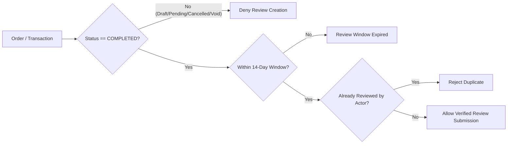
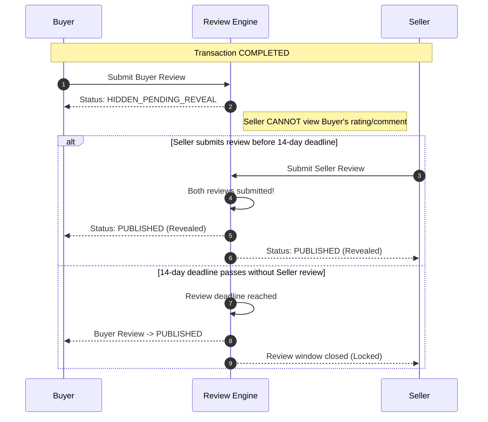

# VERIFIED TRANSACTION REVIEW & REPUTATION ARCHITECTURE ADDENDUM
## Module 00 - Architecture Specification: Verified Counterparty Reviews & Reputation Engine Foundation

> **Core Axiom:** ONLY REAL TRANSACTIONS CAN CREATE REPUTATION.  
> **System Formula:** `TRANSACTION` $\rightarrow$ `VERIFIED REVIEW` $\rightarrow$ `REPUTATION DATA` $\rightarrow$ `TRUST` $\rightarrow$ `BETTER MATCHING` $\rightarrow$ `MORE TRANSACTIONS`  
> **Design Philosophy:** We do not ask *"How popular is this person?"*, we ask: *"How reliably has this Actor transacted?"*

---

## 1. Review Eligibility (Điều Kiện Đánh Giá)

1. **Authoritative Transaction State Required:**
   - Review is strictly allowed **ONLY IF** `transaction.status === "COMPLETED"` (or `order.order_status === "COMPLETED"`).
   - Review is **REJECTED** if transaction state is `DRAFT`, `PENDING`, `CANCELLED`, `FAILED`, `EXPIRED`, `VOIDED`, or `FRAUDULENT`.
2. **Dispute Handling:**
   - If a transaction is `DISPUTED`, review creation may be queued or held in `HIDDEN_PENDING_RESOLUTION` status until resolution is reached.
3. **Refund Handling:**
   - Normal commercial return/refund can still allow verified review if transaction was completed; fraudulent/voided transactions are strictly prohibited.
4. **Service Boundary:**
   - Eligibility is evaluated server-side via `ReviewEligibilityService.canReview(transactionId, actorId)`. The client NEVER decides eligibility.

---

## 2. Transaction Relationship (Gắn Kết Chặt Chẽ Với Transaction)

- Reviews cannot exist independently or be posted directly onto a Profile.
- Every review has a strict foreign key binding to `transaction_id`.
- Review payload derives `reviewer_actor_id`, `reviewee_actor_id`, and `reviewer_role` (`BUYER` | `SELLER`) directly from the authoritative transaction record and authorized session context.

---

## 3. Actor Ownership & Persona Isolation (Thuộc Về Actor, Không Phải Nhân Viên)

- **Actor Level Reputation:** All reputation points, star ratings, and review metrics belong to the **Actor** (Personal Actor or Organization Actor).
- **Audit Field Only:** The specific human user performing the action is logged solely in `performed_by_user_id` for compliance and audit trail.
- If employee *Nguyen Van A* (acting for *ABC Company*) reviews supplier *XYZ*, the public review displays: **ABC Company reviewed XYZ Supplier**.

---

## 4. Personal Context (Giao Dịch Cá Nhân)

- When transacting as a Personal Actor:
  - `reviewer_actor_id` / `reviewee_actor_id` point to `PersonalActor.id`.
  - Privacy safeguards apply: reviewer name is displayed as the public display name or masked (`Trần *** N.`), never exposing phone numbers, emails, or home addresses.

---

## 5. Organization Context (Giao Dịch Doanh Nghiệp)

- When transacting as an Organization:
  - `reviewer_actor_id` / `reviewee_actor_id` point to `Organization.id`.
  - Any authorized member with permission `reviews.create` can submit the review on behalf of the Organization.
  - If the original employee leaves the company, the transaction and review capability remain with the Organization.

---

## 6. Buyer Review Model (Buyer $\rightarrow$ Seller)

Focuses on fulfillment quality, product fidelity, timeliness, and customer support:
- `overall_rating`: **1 to 5 stars** (Required integer)
- `accuracy_rating`: **1 to 5 stars** (Đúng mô tả)
- `timeliness_rating`: **1 to 5 stars** (Đúng hẹn giao hàng)
- `communication_rating`: **1 to 5 stars** (Giao tiếp & hỗ trợ)
- `quality_rating`: **1 to 5 stars** (Chất lượng sản phẩm/dịch vụ - Optional)
- `comment`: Text (Optional, max 1,000 characters, sanitized against XSS)

---

## 7. Seller Review Model (Seller $\rightarrow$ Buyer)

Focuses on payment reliability, clarity of requirements, and mutual cooperation:
- `overall_rating`: **1 to 5 stars** (Required integer)
- `payment_rating`: **1 to 5 stars** (Thanh toán đúng hạn)
- `clarity_rating`: **1 to 5 stars** (Yêu cầu / thông tin rõ ràng)
- `cooperation_rating`: **1 to 5 stars** (Hợp tác & phối hợp)
- `comment`: Text (Optional, max 1,000 characters, sanitized against XSS)

---

## 8. Double-Blind Review Flow (Đánh Giá Hai Chiều Kín Đáo)

To eliminate fear of retaliatory reviews:
1. **Submission Phase:** Buyer submits review $\rightarrow$ status becomes `HIDDEN_PENDING_REVEAL`. Seller cannot see Buyer's rating or comment (neither in UI nor in API responses).
2. **Reveal Condition 1 (Mutual Submission):** When Seller also submits their review $\rightarrow$ both reviews immediately flip to `PUBLISHED` and reveal simultaneously.
3. **Reveal Condition 2 (Window Expiry):** If only one party reviews within 14 days $\rightarrow$ upon reaching `review_deadline`, the submitted review is automatically revealed to `PUBLISHED`, while the non-reviewing party loses the right to review.

---

## 9. Review Window & Deadlines

- `review_available_from`: Immediately upon `transaction.status === "COMPLETED"`.
- `review_deadline`: `completed_at + 14 days`.
- After 14 days, new review creation is rejected.

---

## 10. Review Edit Window (Thời Gian Chỉnh Sửa Hạn Chế)

- After submission, reviewer may edit their rating/comment within a strict **24-hour edit window** (`editable_until = submitted_at + 24 hours`).
- Once 24 hours pass or once both reviews are published/revealed, reviews are permanently locked to prevent reputation tampering.

---

## 11. Review Status Lifecycle

- `DRAFT`: Local draft before submission.
- `SUBMITTED` / `HIDDEN_PENDING_REVEAL`: Submitted, awaiting counterpart review or deadline.
- `PUBLISHED`: Publicly active and counted in reputation aggregation.
- `REPORTED`: Flagged by a user, awaiting moderation inspection.
- `UNDER_REVIEW`: Temporarily held by moderators.
- `HIDDEN`: Hidden due to confirmed policy violation.
- `REMOVED`: Soft-deleted with audit justification.

---

## 12. Rating Aggregation (Tính Toán Điểm Đánh Giá)

- Aggregates are computed **only** from `PUBLISHED` reviews of valid completed transactions.
- Aggregation is stored in cache table `actor_review_stats` but is 100% deterministically recomputable from individual immutable review records.
- Rounding: Displays 1 decimal place (e.g. `4.76` $\rightarrow$ `4.8 ★`).
- Empty State: If `published_review_count === 0`, display **"Chưa có đánh giá"** (never display `0.0 ★`).

---

## 13. Public Visibility & Verified Badge

- Each published review displays the official verified badge:
  - **✓ Đánh giá đã xác minh**
  - Tooltip: *"Đánh giá này đến từ một giao dịch đã hoàn thành trên nền tảng."*
- Never display fake reviews or mock testimonials.

---

## 14. Personal Buyer Privacy

- Personal Buyer profiles do NOT expose detailed punitive star ratings publicly.
- Seller reviews of Personal Buyers contribute to internal risk & trust indicators.
- Personal Buyer public profile displays: Verified status, Completed transactions count, and basic positive trust indicators.

---

## 15. Organization Reputation

- Organization profiles can display full bilateral commercial reliability metrics:
  - Overall rating average & distribution breakdown.
  - Payment reliability (Độ tin cậy thanh toán).
  - Accuracy & on-time delivery rate from real transaction milestones.

---

## 16. Official Response to Review (Phản Hồi Đánh Giá)

- The reviewee Actor may submit **exactly one official response** (`review_response`).
- Response displays clearly underneath the review (e.g. *Phản hồi từ Người Bán: "Cảm ơn bạn..."*).
- Does not alter star ratings; cannot be spammed.

---

## 17. Reporting & Flagging (Báo Cáo Đánh Giá)

- Allows counterparty or community to report inappropriate reviews.
- Standard categories: Spam, Xúc phạm / thô tục, Không liên quan giao dịch, Tiết lộ thông tin cá nhân, Gian lận.
- Stored in `review_reports` with audit log.

---

## 18. Moderation Engine

- Admins can view reported reviews, temporarily hide, restore, or remove.
- Sellers cannot unilaterally delete legitimate negative reviews.
- Audit trail logs all moderator decisions with reasons.

---

## 19. Dispute Interaction

- When a transaction enters `DISPUTED` state, reviews are held in `HIDDEN_PENDING_RESOLUTION`.
- Once dispute is officially resolved, moderation policy determines if reviews are unlocked or voided.

---

## 20. Notifications & Reminders

- **On Transaction Completion:** Notify Buyer & Seller: *"Bạn có thể đánh giá giao dịch với đối tác."*
- **On Double-Blind Reveal:** Notify: *"Đánh giá của giao dịch đã được công bố."*
- **Optional Reminder:** Sent 3 days before the 14-day deadline.

---

## 21. Membership Permissions (Phân Quyền Tổ Chức)

- `reviews.create`: Permission to submit review for organization transactions.
- `reviews.respond`: Permission to post official organization response.
- `reviews.report`: Permission to flag abusive reviews.

---

## 22. RLS & Server-Side Double-Blind Privacy

- **PostgreSQL RLS & API Guard:**
  - Double-blind hidden reviews (`HIDDEN_PENDING_REVEAL`) MUST NEVER be returned in JSON API responses to the counterparty before reveal.
  - Client-side hiding alone is strictly forbidden.

---

## 23. Anti-Abuse Protections

1. **No Transaction $\rightarrow$ No Review:** API requires valid `transaction_id`.
2. **No Self-Review:** Backend rejects if `reviewer_actor_id === reviewee_actor_id`.
3. **No Duplicate:** Unique constraint on `(transaction_id, reviewer_actor_id, reviewee_actor_id)`.
4. **No Cross-Actor Tampering:** Reviewer identity derived from authenticated token + Actor context.
5. **No Post-Deadline Review:** Strict timestamp check against `review_deadline`.

---

## 24. Reputation Engine Separation

- **Formula Principle:** `Reputation != Average Rating`.
- **Target Distribution:**
  - 70–80% Objective Transaction Facts (Completion rate, on-time delivery, on-time payment, zero disputes).
  - 20–30% Verified Peer Reviews.

---

## 25. Future Blockchain-Proof Compatibility

- Review schema contains `review_hash` (SHA-256 of canonical review data) and references `transaction_hash`.
- Readily anchorable to Merkle Batches on Polygon/Trust Rail without storing raw private comments on-chain.

---

## 26. Migration & Legacy Data Cleanliness

- All mock/dummy reputation scores (e.g. 4.9, 96/100, 99.2%) remain strictly purged from runtime UI.
- All reputation metrics are dynamically derived from real transactions and genuine reviews.

---

## 27. Acceptance Tests (Bộ Tiêu Chí Chấp Nhận)

| Test ID | Test Scenario | Expected Outcome | Status |
|---|---|---|---|
| **AT-01** | Buyer reviews completed Seller transaction | Review stored in `HIDDEN_PENDING_REVEAL`, verified badge ready. | Target Pass |
| **AT-02** | Seller reviews completed Buyer transaction | Uses seller criteria (Payment/Clarity/Cooperation). | Target Pass |
| **AT-03** | Double-Blind mutual submission | Both reviews reveal simultaneously to `PUBLISHED`. | Target Pass |
| **AT-04** | 14-Day Deadline Reveal | Single submitted review auto-publishes; late counterparty blocked. | Target Pass |
| **AT-05** | Duplicate review attempt | Backend rejects duplicate submission. | Target Pass |
| **AT-06** | Review without completed transaction | Backend rejects with 403 Forbidden. | Target Pass |
| **AT-07** | Review on cancelled transaction | Review creation denied. | Target Pass |
| **AT-08** | Organization member review | Review belongs to Organization Actor, audit logs user. | Target Pass |
| **AT-09** | Self-review attempt | Backend rejects with 400 Bad Request. | Target Pass |
| **AT-10** | Empty state handling | Displays "Chưa có đánh giá", no fake fallback. | Target Pass |
| **AT-11** | Review reporting & moderation | Admin can inspect report and hide/restore review. | Target Pass |
